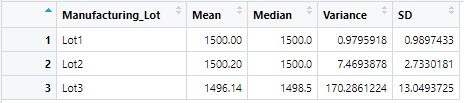
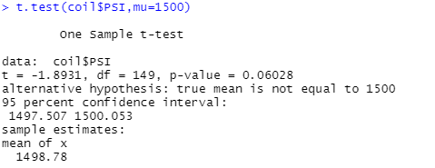
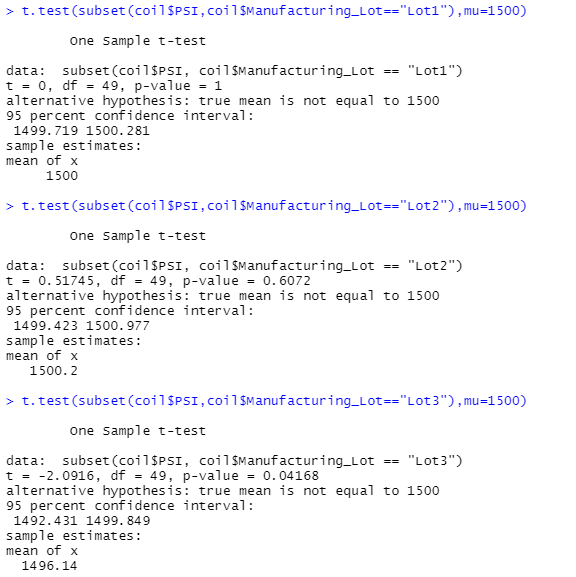

# MechaCar Statistical Analysis

## Linear Regression to Predict MPG

Two of the five variables provided a non-random amount of variance to the mpg values: vehicle length and ground clearance. This is evidenced by their p-values of 2.60e-12 and 5.21e-08, respectively. Vehicle weight, spoiler angle, and AWD had p-values of 0.0776, 0.3069, and 0.1852, respectively, and therefore do not meet the p-value < 0.05 condition to be considered non-random.

The slope of the linear model is considered to be non-zero as the p-value of the regression is analysis is 5.35e-11. This value is less than 0.05, so we reject the null hypothesis that the slope of the linear model is zero and conclude that the slope is not zero.

This linear model predicts miles per gallon of MechaCars fairly well, as evidenced by the R squared value of 0.7149. This means that roughly 71.49% of the data used to perform the regression fits the resultant model. This number could of course be higher, but is a good starting point from a relatively small dataset.

## Summary Statistics on Suspension Coils

 

Overall, the manufacturing appears to meet design specifications, as the variance for all lots in total is under 100 PSI. However, when breaking down the coils by lot, it is clear that Lot 3 does not meet specifications with a variance of roughly 170 PSI. Coils in lots 2 and 3 are acceptable, but lot 3 needs to be further examined.

## T-Tests on Suspension Coils

The t-test of PSI across all manufacturing lots yielded a p-value of 0.06028. Since this is greater than 0.05, we cannot conclude that the sample mean is not equal to the population mean of 1500.

The t-tests for PSI across the individual lots yielded p-values of 1, 0.6072, and 0.04168 for Lot 1, Lot 2, and Lot 3, respectively. We cannot conclude that the sample means for Lots 1 and 2 are not equal to the population mean of 1500; however, reject the null hypothesis in the t-test for Lot 3 and conclude that the sample mean is not 1500.
